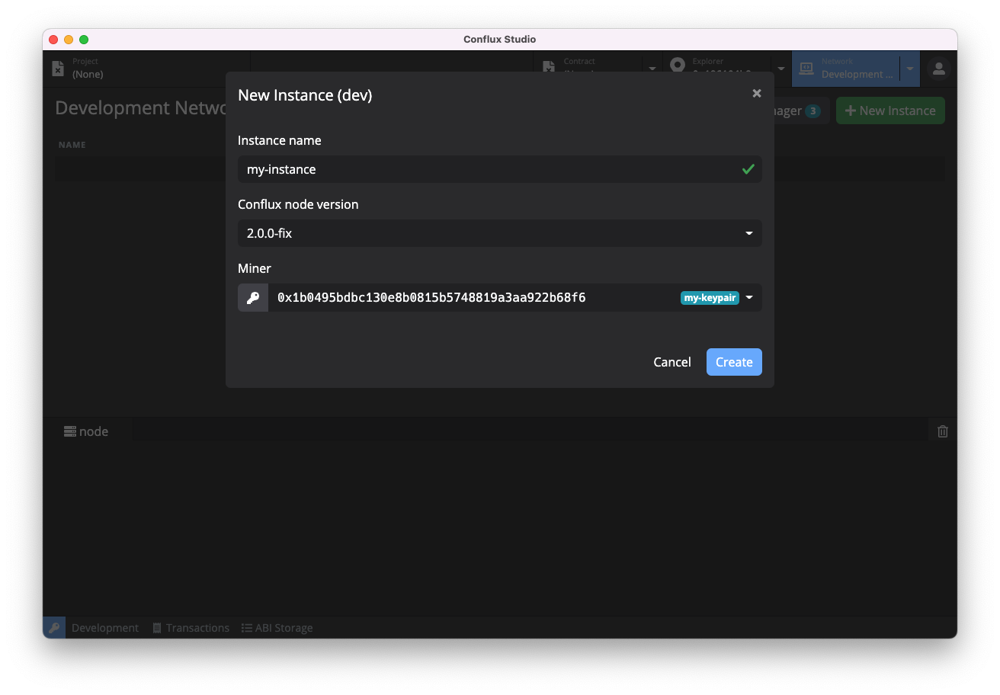

# Conflux Studio

[Click here for English version](https://github.com/ObsidianLabs/ConfluxStudio/blob/master/README.md)

Conflux Studio 是一个帮助开发者快速开发 [Conflux](https://confluxnetwork.org/) 智能合约的集成化开发环境。Conflux Studio 现已提供运行于 macOS, Windows 和 Linux 的桌面版，以及运行于现代浏览器环境中的  [Conflux Studio Web](https://conflux.ide.black) 版。

  

## 使用 Conflux Studio

### Conflux Studio 桌面版

Conflux Studio 安装包可以在 [Github Releases](https://github.com/ObsidianLabs/ConfluxStudio/releases) 进行下载。目前 Conflux Studio 桌面版支持 macOS , Linux 和 Windows 系统，请根据系统下载对应的版本 (macOS 下载 `.dmg` 或者 `.zip`，Linux 下载 `.AppImage`, Windows 下载 `.exe`)。

- **macOS**: 双击打开 `ConfluxStudio-x.x.x.dmg` 并将 `Conflux Studio` 拖动到应用文件夹内。
  - 第一次运行 Conflux Studio 时，可能会收到系统提示 *”无法打开 "Conflux Studio" , 因为 Apple 无法检查其是否包含恶意软件。“* 此时请打开 *“系统偏好设置”* ，前往 *“安全性与隐私”* 。点按 *“通用”* 面板中 *“仍要打开”* 按钮以允许Conflux Studio运行。
- **Linux**: 双击打开 `ConfluxStudio-x.x.x.AppImage`, 选择 *Properties* => *Permissions* => *Execute*, 将 *Allow executing file as program* 选项打勾。关闭属性设置窗口并双击打开应用（不同的 Linux 发行版可能会有不同的安装方式）。
- **Windows**:  双击打开 `ConfluxStudio-x.x.x.exe`。

### Conflux Studio Web 版

- 在浏览器地址栏中打开 [https://conflux.ide.black](https://conflux.ide.black) 以访问 Conflux Studio Web 版集成开发环境。

## Conflux dApp 开发示例教程

我们通过 Conflux Studio 开发基于 Conflux 区块链上的智能合约。智能合约类似于传统开发流程中的后端服务，它规定一系列链上的交易以完成我们开发中所设定好的功能任务。为了使用户能够方便的调用这些底层服务，避免不必要的门槛和编程的麻烦，我们也还需要编写一个前端应用作为用户界面，这个前端应用以及后端服务组成了一个简单易用的区块链应用，也叫去中心化应用或者dApp 。

你可以前往 [Conflux dApp 开发教程](https://github.com/ObsidianLabs/conflux-dapp-tutorial/blob/master/README-CN.md)学习如何使用 Conflux Studio 完整地开发一款代币 dApp。

## 功能预览

以下示例以 Conflux Studio v0.14.0 macOS 桌面版为例，Conflux Studio 各版本操作界面和功能均保持一致，实际操作以界面显示为准。

### 准备工作 

在正确安装 Conflux Studio 桌面版并初次启动时，你将看到一个欢迎页面，这里有 Conflux Studio 正常运行所需要的依赖，包括了 Docker，Conflux Node 以及 Conflux Truffle。Conflux Studio Web 版无需安装依赖，因此访问 Web 版将直接进入主界面。

  

- Conflux Studio 使用 [**Docker**](https://www.docker.com/) 来启动 Conflux 节点和进行项目编译。如果你之前没有安装过 Docker，可以点击 *Install Docker* 按钮访问 Docker 官方网站并进行下载安装。
- [**Conflux Node**](https://github.com/Conflux-Chain/conflux-rust) 是 Conflux 官方提供的 Conflux 节点镜像，Conflux Studio 使用这个镜像来运行 Conflux 节点以及项目编译
- [**Conflux Truffle**](https://github.com/Conflux-Chain/conflux-truffle) 是 Conflux 版本的 Truffle。Conflux Studio 使用这个工具包进行项目的创建和编译。

当所有依赖都正确安装并运行后，灰色的 *Skip* 按钮将会变成蓝色的 *Get Started* 按钮。点击这个按钮进入 Conflux Studio 的主界面。

### 密钥管理器

进入主界面后，我们需要首先创建一些密钥对。在 Conflux Studio 的任意界面，点击应用左下⻆的钥匙图标，打开密钥管理器。

  

密钥管理器会将不同网络下的密钥对进行分类显示，如果需要查看或管理其他网络下的密钥对，点击密钥管理器中间的标签以切换显示本地开发节点 、 测试网或者主网下的密钥对，你也可以点击全部网络已显示所有密钥对。

你可以在密钥管理器中自由的创建，导入并管理密钥对。单击密钥管理器界面左下角的 *Create* 按钮，根据提示输入密钥对名称并选择网络以新建一个密钥对。或者单击 *Import* 按钮，导入已有密钥对。密钥对名称是一个由用户自定义的名称，目的是方便在后续的使用中进行识别。

Conflux Studio支持以私钥或者助记词的方式生成或者导入密钥。生成密钥时， Conflux Studio 默认以私钥方式生成密钥。如需切换为助记词，请点击 *Regenerate* 按钮旁边的三角箭头切换。

**私钥和助记词是证明密钥所有权的关键凭证，请妥善保管，不要与他人分享。**

  

**在继续之前，请先在密钥管理器中创建一些密钥对，以便我们继续接下来的操作步骤。**

### 本地开发节点

点击顶部的 *Network* 标签，主页面将切换为网络管理器。在网络管理器中，我们可以进行 Conflux 节点版本和节点实例的管理，包括下载、删除 Conflux 节点版本，根据不同版本创建、删除和运行节点实例。

点击主页面中右上角的 *New Instance* 按钮打开创建新实例的弹窗，填写实例名称和选择合适的版本，点击 *Create* 按钮完成节点实例的创建。

创建新的 Conflux 节点实例时，你需要在已有的密钥地址中指定一个 Miner (矿工)。Miner 将作为本地网络的矿工进行出块，并持续获得 CFX 代币作为奖励。当 Conflux 本地节点第一次运行时，会将密钥管理器里所有的地址作为创世地址，每个地址得到 10,000 CFX 的初始代币。

  

节点实例创建完成后，点击实例的绿色 *Start* 按钮启动 Conflux 节点。启动完成后，你可以在下方的日志查看器中检查节点运行日志。

  

### 远程网络节点

Conflux Studio 中已经内置了 Conflux 主网和测试网的链接信息。点击 *Network* 标签旁的三角箭头，可以直接选择连接或者一键切换希望使用的 Conflux 网络。

### 自定义节点

Conflux Studio 支持连接自定义远程网络节点。点击 *Network* 标签旁的三角箭头，选择 *Custom Network* 。根据提示输入希望连接的Node URL 信息即可连接。

### 区块浏览器

节点启动后，点击顶部的 *Explorer* 标签，主页面将切换为区块浏览器。在区块浏览器中，我们可以查询对应地址的信息。这些信息包括代币信息以及交易记录。

从密钥管理器中复制刚刚生成的地址，将地址粘贴在地址栏并点击回车，我们便可以看到对应地址的余额信息了。如果希望查看的地址是密钥管理器中已保存的密钥地址，可以直接点击*Explorer* 标签右侧的三角箭头通过下拉菜单选择希望访问的密钥地址。Conflux 暂不支持查看本地开发节点的历史交易记录。将网络切换到测试网或主网，区块浏览器中便可以查看历史交易记录了。

  

当连接主网或者测试网查询信息时，区块浏览器可以显示地址下所有种类 ERC-20 代币信息（ ERC-20 代币标准与 CRC-20 代币标准可等价互换，本教程中所指的 ERC-20 代币标准实际均指 CRC-20 ）。

  

Conflux Studio 区块浏览器在地址栏右侧集成了常用工具以方便用户使用。当连接主网时，可以单击地址栏右侧的 *Transfer* 按钮进行快速转账，该转账功能支持使用账户中任何一种 ERC-20 代币进行交易。单击 *Convert* 按钮可以进行地址转换。当连接测试网时，除了快速转账和地址转换功能外，亦可以通过点击 *Faucet* 按钮申请代币。每次使用 Faucet 功能时，Conflux Studio 会自动申请 CFX 以及 cUSDT 两种测试代币。不过 Faucet 所申请的这两种代币均为测试代币，是没有实际货币价值的。

### 创建智能合约项目

点击顶部的 *Project* 标签，主页面将切换至项目管理器。点击页面右上角的 *New* 按钮打开创建项目弹窗，输入项目名称并选择合适的模版，Conflux Studio 目前提供了两个模版：

- `coin`：Conflux实例提供的coin智能合约
- `[Truffle] metacoin`：使用Conflux Truffle创建的合约；该项目目前无法部署到 Conflux 节点

  

项目创建完成后，主页面将切换至项目编辑器。项目编辑器由几个部分组成，包括了文件浏览器，代码编辑器，工具栏，日志查看器等多个开发常用模块。

### 编译智能合约项目

点击工具栏的编译按钮（锤子形状），Conflux Studio 将进行项目的编译，你可以通过下方的日志查看器来查看编译结果。编译后将在项目目录下的 `build` 文件夹中生成 json 文件。

  

### 部署智能合约项目

点击工具栏的部署按钮（船形状），部署参数窗口将被打开，在这里可以输入构造函数的参数、交易签名者、gas limit 和 gas price。

  

点击 *Deploy* 按钮 Conflux Studio 将进行项目部署，部署结果将会弹窗显示。

  

### 调用合约

成功部署智能合约后，点击弹窗中点击蓝色的 *contract* 按钮，主页面将切换至合约浏览器，Conflux Studio 将自动打开刚才部署完成的智能合约。

合约浏览器页面主要分为两个部分：

- 左边为合约的调用方法，点击左半部分的左上角蓝色按钮弹出的下拉框显示当前合约所定义的方法，点击方法名称可以切换调用的方法。
- 右边为合约的数据读取，点击右半部分的左上角蓝色按钮弹出的下拉框显示当前合约的数据表，点击表名称可以切换查看不同表中的数据。

Conflux Studio 会自动读取合约 ABI 中的 functions，并为每个 function 生成参数表单。用户可以简单的选择要调用的 function，输入参数，选择签名者（需要为 keypair manager 中存在的地址；读操作不需选择），并点击运行按钮进行合约调用。调用结果（成功或失败）将显示在下方的 result 栏中。

  

接下来我们使用部署好的合约创建 *coin*。选择 *mint* 方法，在 *Parameters* 下填入 *receiver* 地址（可以从密钥管理器中复制）和在 *amount* 中填入合适的数量，在 *Authorization* 中填入创世地址，点击上方的执行按钮。完成交易后，我们可以在左下角的 *Result* 中看到成功执行的结果。此时我们已经创建了新的 *coin*。

在右边的 *balance* 表中，在 Parameters 下输入刚刚填入的 *receiver* 地址，点击执行按钮，便可以看到刚刚 *mint* 的总数了。

  

