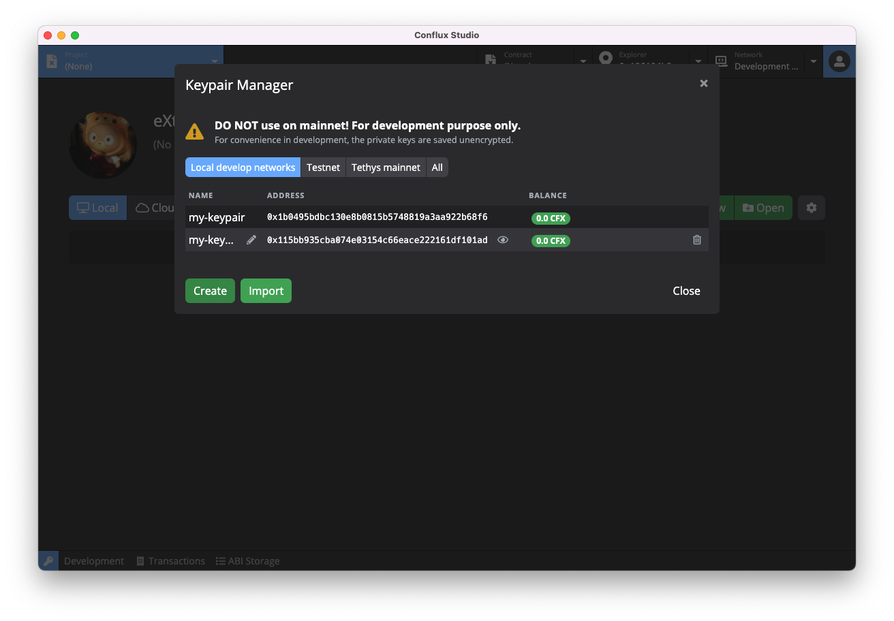
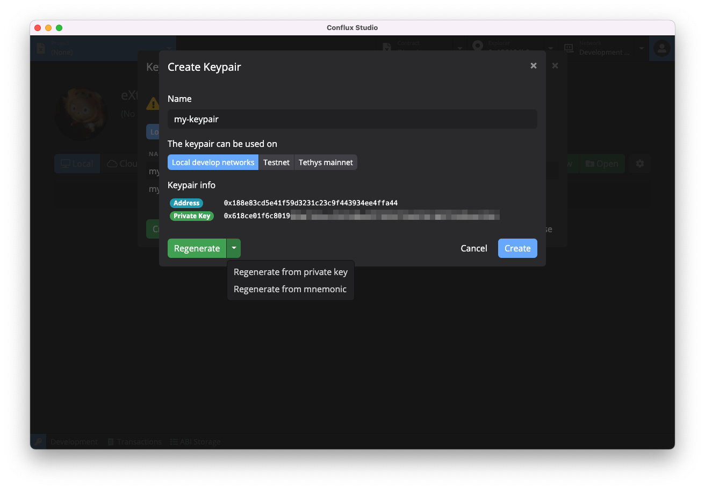
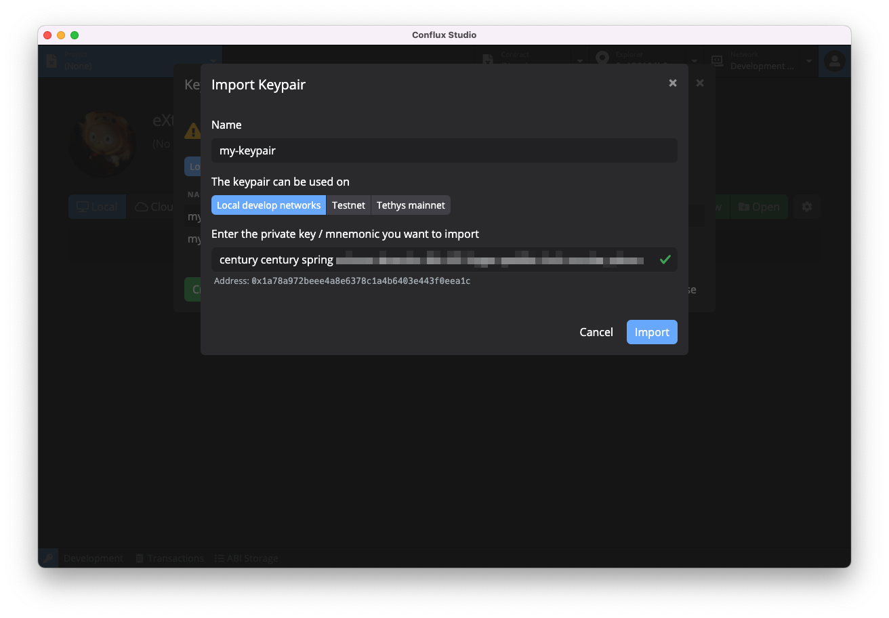
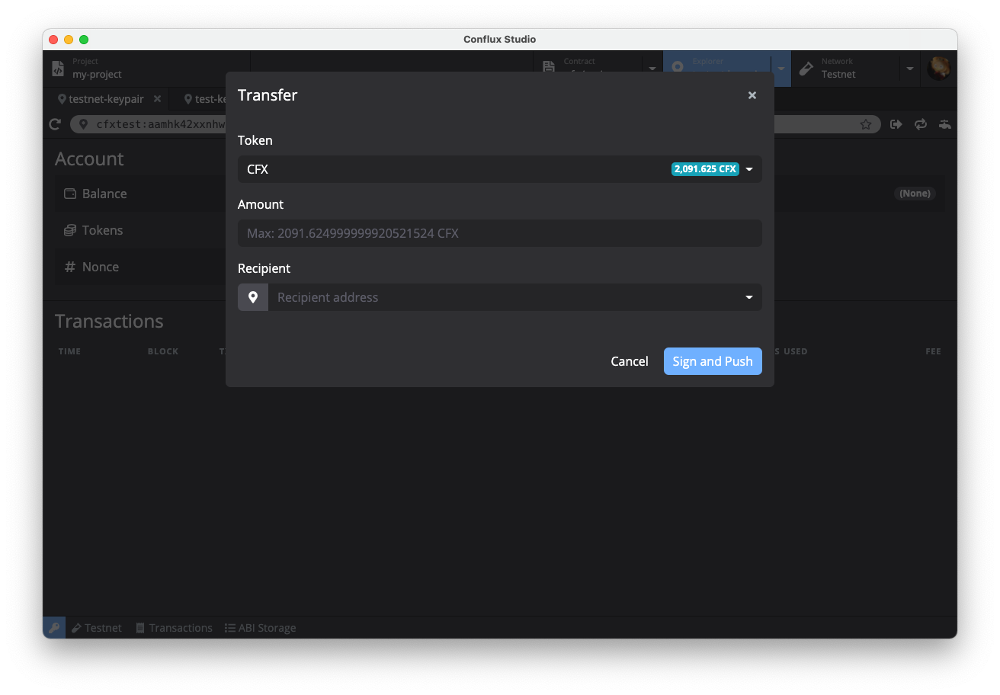
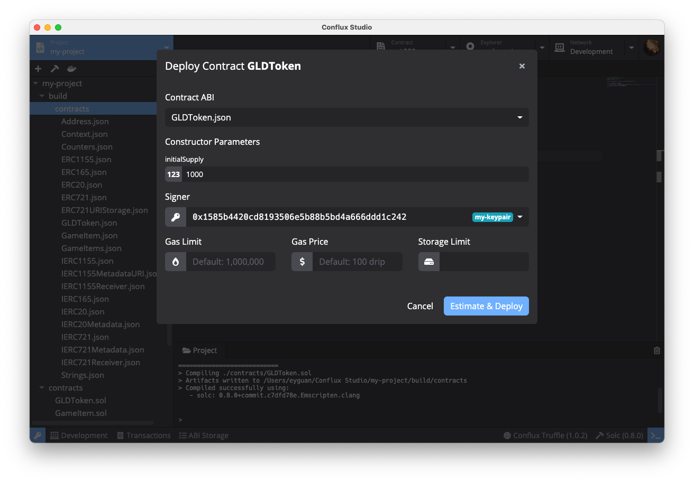

# Conflux Studio

[Click here for English version](https://github.com/ObsidianLabs/ConfluxStudio/blob/master/README.md)

Conflux Studio 是一个帮助开发者快速开发 [Conflux](https://confluxnetwork.org/) 智能合约的集成化开发环境。Conflux Studio 现已提供运行于 macOS、Windows 和 Linux 的桌面版，以及运行于现代浏览器环境中的 [Conflux Studio Web](https://conflux.ide.black) 版。

  

## 使用 Conflux Studio

### Conflux Studio 桌面版

Conflux Studio 安装包可以在 [Github Releases](https://github.com/ObsidianLabs/ConfluxStudio/releases) 进行下载。目前 Conflux Studio 桌面版支持 macOS、Linux 和 Windows 系统，请根据系统下载对应的版本 （macOS 下载 `.dmg` 或者 `.zip`，Linux 下载 `.AppImage`， Windows 下载 `.exe`）。

- **macOS**: 双击打开 `ConfluxStudio-x.x.x.dmg` 并将 `Conflux Studio` 拖动到应用文件夹内。
  - 第一次运行 Conflux Studio 时，可能会收到系统 *”无法打开 "Conflux Studio"，因为 Apple 无法检查其是否包含恶意软件“* 的提示。此时请打开 *系统偏好设置* ，前往 *安全性与隐私* 。点按 *通用* 面板中 *仍要打开* 按钮以允许 Conflux Studio 运行。
- **Linux**: 双击打开 `ConfluxStudio-x.x.x.AppImage`， 选择 *Properties* => *Permissions* => *Execute*， 将 *Allow executing file as program* 选项打勾。关闭属性设置窗口并双击打开应用（不同的 Linux 发行版可能会有不同的安装方式）。
- **Windows**:  双击打开 `ConfluxStudio-x.x.x.exe`。

### Conflux Studio Web 版

在浏览器中打开 [https://conflux.ide.black](https://conflux.ide.black) 以访问 Conflux Studio Web 版。

## Conflux dApp 开发示例教程

通过 Conflux Studio 可以开发基于 Conflux 区块链上的智能合约。智能合约类似于传统开发流程中的后端服务，它规定一系列链上的交易以完成我们开发中所设定好的功能任务。为了使用户能够方便的调用这些底层服务，避免不必要的门槛和编程的麻烦，我们也还需要编写一个前端应用作为用户界面。这个前端应用以及后端服务组成了一个简单易用的区块链应用，也叫去中心化应用或者 dApp。

你可以前往 [Conflux dApp 开发教程](https://github.com/ObsidianLabs/conflux-dapp-tutorial/blob/master/README-CN.md)学习如何使用 Conflux Studio 完整地开发一款代币 dApp。

## 功能预览

以下示例以 Conflux Studio v0.14.0 macOS 桌面版为例，Conflux Studio 各版本操作界面和功能均保持一致，实际操作以界面显示为准。

### 准备工作 

在正确安装 Conflux Studio 桌面版并初次启动时，你将看到一个欢迎页面，同时也是环境准备界面。这里列出了 Conflux Studio 正常运行所需要的依赖，包括了 Docker，Conflux Node 以及 Conflux Truffle。因为 Conflux Studio Web 版无需安装依赖，所以访问 Web 版将直接进入主界面。

  

- Conflux Studio 使用 [**Docker**](https://www.docker.com/) 来启动 Conflux 节点和进行项目编译。如果你之前没有安装过 Docker，可以点击 *Install Docker* 按钮访问 Docker 官方网站并进行下载安装。
- [**Conflux Node**](https://github.com/Conflux-Chain/conflux-rust) 是 Conflux 官方提供的 Conflux 节点镜像，Conflux Studio 使用这个镜像来运行 Conflux 节点以及项目编译。
- [**Conflux Truffle**](https://github.com/Conflux-Chain/conflux-truffle) 是 Conflux 版本的 Truffle。 Conflux Studio 使用这个工具包进行项目的创建和编译。

当所有依赖都正确安装并运行后，灰色的 *Skip* 按钮将会变成蓝色的 *Get Started* 按钮。点击这个按钮进入 Conflux Studio 的主界面。

### 密钥管理器

进入主界面后，我们需要首先创建一些密钥对。在 Conflux Studio 的任意界面，点击应用左下⻆的钥匙图标，打开密钥管理器。

  

密钥管理器会将不同网络下的密钥对进行分类显示，如果需要查看或管理其他网络下的密钥对，点击密钥管理器中间的标签以切换显示本地开发节点 （Local develop networks） 、测试网 （Testnet） 或者主网 （Tethys Mainnet） 下的密钥对，你也可以点击全部网络 （All） 以显示所有密钥对。

你可以在密钥管理器中创建、导入并管理密钥对。点击密钥管理器左下角的 *Create* 按钮，根据提示输入密钥对名称并选择网络以新建一个密钥对。密钥对名称是一个由用户自定义的名称，目的是方便在后续的使用中进行识别。Conflux Studio 支持以私钥或助记词的方式生成密钥。生成密钥时，默认以私钥方式生成。如需切换为助记词，请点击 *Regenerate* 按钮旁边的三角箭头切换。

  

如需导入密钥，点击密钥管理器左下角的 *Import* 按钮，输入密钥对名称，并在私钥/助记词输入框中输入希望导入的私钥或助记词，Conflux Studio 将根据输入格式自动检测。如果输入的是有效的私钥或助记词，输入框下方将显示对应的地址，确认无误后点击 *Import* 按钮即可完成导入。

  

在继续之前，请先在密钥管理器中创建一些密钥对，以便我们完成接下来的操作步骤。

**注意：私钥和助记词是证明密钥所有权的关键凭证，请妥善保管，不要与他人分享。泄漏私钥或助记词，可能导致数字资产永久丢失。**

### 网络管理

#### 本地开发节点

点击顶部的 *Network* 标签，主页面将切换为网络管理器。在网络管理器中，我们可以进行 Conflux 节点版本和节点实例的管理，包括下载、删除 Conflux 节点版本，根据不同版本创建、删除和运行节点实例。

点击主页面中右上角的 *New Instance* 按钮打开创建新实例的弹窗，填写实例名称和选择合适的版本，点击 *Create* 按钮完成节点实例的创建。

创建新的 Conflux 节点实例时，你需要在密钥管理器已保存的密钥地址中指定一个矿工（Miner）。Miner 将作为本地网络的矿工进行出块，并持续获得 CFX 代币作为奖励。当 Conflux 本地节点第一次运行时，会将密钥管理器里所有的地址作为创世地址，每个地址会因此得到 10,000 CFX 的初始代币。

  

节点实例创建完成后，点击实例的绿色 *Start* 按钮启动 Conflux 节点。启动完成后，你可以在下方的日志查看器中检查节点运行日志。

  

#### Conflux 测试网/主网

Conflux Studio 中已经内置了 Conflux 主网和测试网的链接信息。点击 *Network* 标签旁的三角箭头，可以直接选择连接或者一键切换希望使用的 Conflux 网络。

  

#### 自定义网络

Conflux Studio 支持连接自定义远程网络节点。点击 *Network* 标签旁的三角箭头，选择 *Custom Network*。根据提示输入希望连接的 Node URL 信息即可连接。

### 区块浏览器

节点启动后，点击顶部的 *Explorer* 标签，主页面将切换为区块浏览器。在区块浏览器中，我们可以查询对应地址的信息。这些信息包括代币信息以及交易记录。

点击 *Explorer* 标签右侧的三角箭头，在下拉菜单中选择希望访问的密钥地址，即可查看对应地址的账户信息了。另外，也可以在区块浏览器的地址栏中输入待查看的密钥地址来查看信息。目前 Conflux Studio 暂不支持查看本地开发节点的历史交易记录。将网络切换到测试网或主网，区块浏览器中便可以查看历史交易记录了。

  

当连接主网或者测试网查询信息时，区块浏览器可以显示地址下所有 [ConfluxScan](https://confluxscan.io/) 已收录的[测试网 CRC-20 代币](https://testnet.confluxscan.io/tokens/crc20)或[主网 CRC-20 代币](https://www.confluxscan.io/tokens/crc20)信息（CRC-20 标准与 ERC-20 标准是等价的，本教程将不区分 ERC-20 和 CRC-20）。

  

Conflux Studio 区块浏览器在地址栏右侧集成了常用工具以方便用户使用，可以单击按钮调用相应工具：

- 点击 *Transfer* 按钮以进行快速转账，该转账功能支持使用 CFX 或其拥有的 ERC-20 代币进行交易。在转账弹窗中选择需要转账代币，填写参数后点击 *Sign and Push* 以执行交易。每笔转账交易都会在[历史交易记录](#历史交易记录)中以便之后再次查看。

  

- 点击 *Convert* 按钮以进行地址格式转换。
- 当连接测试网时，点击 *Faucet* 按钮可申请测试代币。每次使用 Faucet 功能时，Conflux Studio 会自动申请 1,000 CFX 以及 1,000 cUSDT 两种测试代币。不过，测试网上所申请的这两种代币均为测试代币，是没有实际价值的。

### 智能合约项目

#### 项目列表

点击顶部的 *Project* 标签，主页面将切换至项目管理器。点击页面右上角的 *New* 按钮打开创建项目弹窗，输入项目名称并选择合适的模版，Conflux Studio 目前提供了多种模版：

- `Coin`：Conflux 实例提供的 Coin 智能合约。

- `Sponsored Coin`：Conflux 实例提供的 Sponsored Coin 智能合约。

- `[Open Zeppelin]`：基于 [Open Zeppelin](https://openzeppelin.com/) 智能合约库的模板，提供了 ERC-20、ERC-721（NFT）、ERC-777 和 ERC-1155 等合约。

- `[Truffle] Metacoin`：使用 Conflux Truffle 创建的合约；该项目目前无法部署到 Conflux 节点。

  

这里我们使用 Open Zeppelin 的 Basics 模版创建一个名为 `my-project` 的项目，并使用这个项目完成后续操作。

#### 项目编辑器

项目创建完成后，主页面将切换至项目编辑器。项目编辑器由几个部分组成，包括了左侧的文件浏览器，文件浏览器上方的工具栏，右侧上半部分的代码编辑器以及右侧下半部分的日志查看器等多个开发常用模块。

  

点击工具栏中右侧的 *Project Settings*（齿轮形状）图标，打开项目设置标签页。在这里可以查看和修改项目的基本配置，编译器配置以及 Linter 配置等信息。

  

Conflux Studio 的项目编辑器内置了 Linter，可以在代码编辑过程中自动检查代码并提示项目代码中的警告和错误。 项目编辑器会在有警告的代码行前标注黄色的惊叹号，在错误的代码行前标注红色的叉作为提示。

  

#### 编译智能合约

点击工具栏的 *Build* 按钮（锤子形状），Conflux Studio 将进行项目的编译，你可以通过下方的日志查看器来查看编译结果。编译后将在项目目录下的 `build/contracts` 文件夹中查看到编译完成的 `*.json` 文件，这些编译输出文件的数据格式可参阅 [solc 文档](https://docs.soliditylang.org/en/latest/using-the-compiler.html#output-description)。

  

另外也可以通过右键点击 `sol` 文件，在菜单中选择 *Compile*，单独编译选中的合约文件。

#### 部署智能合约

点击工具栏的 *Deploy* 按钮（船形状），部署合约弹窗将被打开，在这里可以输入部署合约所需要的各项参数：

- Compiled Contract：等待部署的合约[编译输出文件](https://docs.soliditylang.org/en/latest/using-the-compiler.html#output-description)，为 JSON 格式。一个项目内可能存在多个合约，可以通过下拉菜单中选择需要部署合约的编译输出文件；
- Constructor Parameters：合约构造函数需要的参数，Conflux Studio 将自动根据数据格式生成参数表单，在此填入创建合约所需要的各项参数；
- Signer：为合约部署交易进行签名的密钥地址，需要为密钥管理器中已有的密钥，通过下拉菜单中选择；
- Gas Limit、Gas Price、Storage Limit：合约部署的交易费用信息，部署前 Conflux Studio 会进行估算，也可使用自行填写的值进行覆盖。

另外，也可以在文件浏览器中，右键点击一个 JSON 格式的编译输出文件，在菜单中选择 *Deploy*，对该合约进行部署。 

  

现在右键点击 `GLDToken.json` ，选择 *Compile* 以调出部署弹窗。在弹窗中填写构造函数参数，并选择签名密钥地址后，点击 *Estimate & Deploy* 按钮，Conflux Studio 会自动估算所需的交易费用并填入对应栏目中。如需重新估算，请点击左侧绿色 *Re-estimate* 按钮。有时候预估的交易费用可能是不够的，如果部署的时候出现交易费用不足的错误，可以手动提高交易费用后重试。点击蓝色 *Deploy* 按钮，Conflux Studio 将发送合约部署交易。

部署交易需要一些时间被区块链网络处理。大约十几秒后，Conflux Studio 会弹出交易详情弹窗显示部署结果，包括部署参数（Parameters）、交易数据（Tx）、交易收据（Receipt）、ABI 等详细信息，可点击弹窗中的标签进行切换。若在本弹窗关闭之后仍想查看本次部署结果和交易详情信息，请参考[历史交易记录](#历史交易记录)。

  

### 调用合约

成功部署智能合约后，点击弹窗中 Contract Created 栏的合约地址，页面将自动切换至合约浏览器。你也可以点击顶部的 *Contract* 标签切换至合约浏览器，在地址栏中输入希望打开的合约地址。Conflux Studio 支持同时打开多个合约，方便进行多合约的调试工作。

合约浏览器页面主要分为三个部分：

- 左边栏用于调用合约的写入方法：点击蓝色下拉框，选择希望调用该合约的写入方法；
- 中间栏用于进行合约的数据读取：点击蓝色下拉框，选择希望查询该合约的读取方法；
- 右边栏用于进行合约的事件查询，点击蓝色下拉框，选择希望查询该合约的事件。

  

Conflux Studio 在部署合约后将自动保存合约 ABI，并在读取合约时候通过 ABI 中的数据，生成上面的写入方法、数据读取、事件查询，和它们各自的参数表单。更多 ABI 的使用方法可以参考 [ABI Storage](#abi-storage)。

接下来我们在合约浏览器中打开刚刚部署的 `GLDToken` 合约，演示如何使用写入方法、读取数据和查询事件。

首先在写入方法调用窗口中选择 *approve* （演示 tranfer 方法吧，这个最常用，但是现在写的这些先都留好，在我们的eth文档中可以用到，包括限免的allowance和approval事件）方法，这个方法可以批准合约地址一定的消费额度，用于之后的交易。接下来填入完成交易必须的各项参数：

- 在 Parameters 下填入 spender 地址（可以从密钥管理器双击复制），并在 amount 中填入合适的数量。
- 无需填写 Gas & Storage 栏目中的交易费用（由 Conflux Studio 自动估算），
- 在 Authorization 的下拉菜单中选择创世地址。

完成后，点击上方的方法名称旁的 *Execute* 按钮（三角形状）执行交易。稍后弹窗会提示交易成功及交易费用信息。

  

接下来，我们来验证一下上笔交易的结果。在合约读取窗口中选择 *allowance* （这里介绍 balanceOf）数据栏，在 Parameters 下填入 owner 地址和 spender 地址，最后点击上方的数据名称旁的 *Execute* 按钮（三角形状）。结果会显示在下方 Result 栏目中，这个结果与我们上笔交易中 *approve* 的 amount 数量一致，这验证了我们之前交易的结果。

  

最后我们在事件查询窗口中选择 *Approval* 事件（这里介绍 Tranferred），并点击 *Execute* 按钮（三角形状）以查询合约中所有 *Approval* 相关事件，结果会显示在下方 Event Logs 窗口中。在进行事件查询时， Conflux Studio 允许自定义查询范围。但当连接本地开发节点或者测试网时，事件查询最多只能返回 10,000 条记录，请保持自定义范围小于等于该数字。默认情况下事件查询窗口将返回最新 10,000 条记录。当连接 Conflux 主网时，事件查询最多只能返回 1,000 条记录。

  

#### ABI Storage

在使用合约浏览器时，Conflux Studio 需要基于合约 ABI 生成各读写方法和查询事件的界面，底部栏中的 ABI Storage 就是保存这些合约 ABI 的地方。在合约部署成功后，Conflux Studio 将自动保存合约的 ABI。当鼠标移动到 ABI 条目上时，可以点击 *Edit* 按钮（铅笔形状）查看 ABI 原始数据，也可以点击 *Delete* 按钮删除 ABI 条目。

  

如果需要调用其它合约（例如线上合约），就需要将合约的 ABI 添加到 ABI Storage 中。使用 ABI Storage 中的 *New* 按钮即可完成该操作。为方便使用，Conflux Studio 也会自动读取当前项目中已编译过合约的 ABI，单击弹窗左下角 *Select from the current project* 按钮，从列表中选择即可。

  

#### 历史交易记录

Conflux Studio 会记录每笔发布到链上的交易。如需查看最近的交易记录，点击底部栏的 *Transactions* 按钮即可唤出最近交易记录的列表。可以点击单笔交易以打开交易确认弹窗，并查看交易详情、参数 （Parameters） 、交易数据 （Tx）、交易收据 （Receipt）和 ABI 等详细信息。

  

#### RPC Client

Conflux Studio 还提供了直接从底层调用 Conflux 节点 RPC 接口的功能。点击底部栏的网络按钮，在弹出菜单中选择并打开 RPC Client 后，可以看到 Conflux 节点的全部 RPC 接口。对每个 RPC 接口，Conflux Studio 也将生成对应的参数表格，填写数据后点击 *Execute* 按钮运行，即可完成调用并查看返回数据。

  

