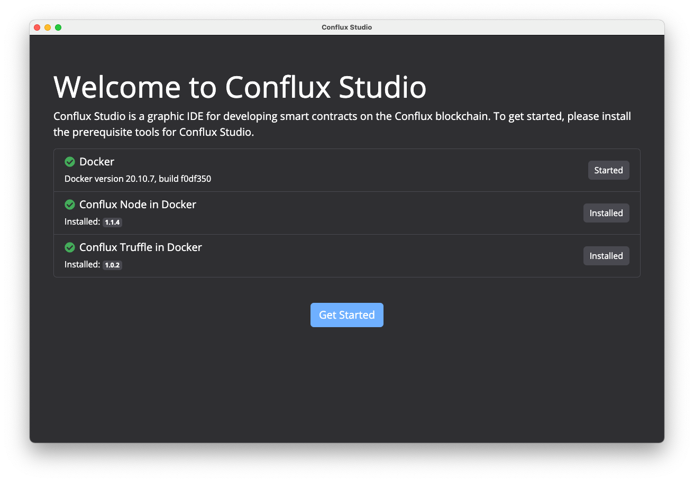
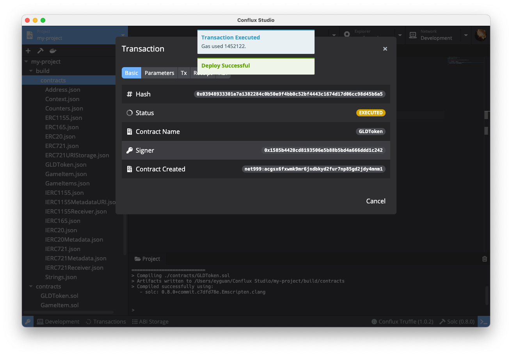
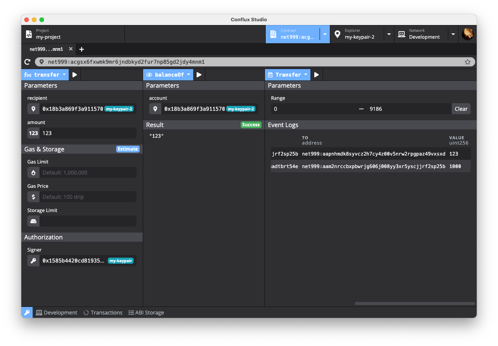
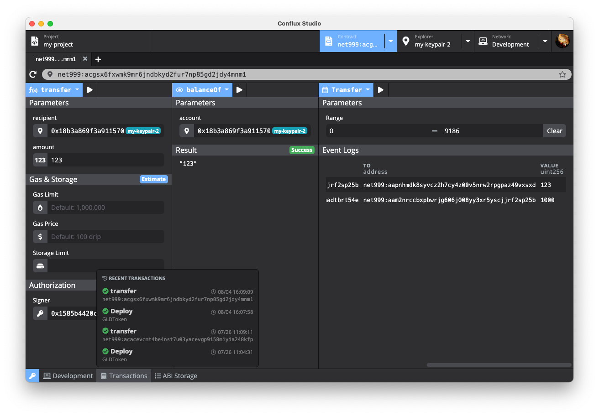
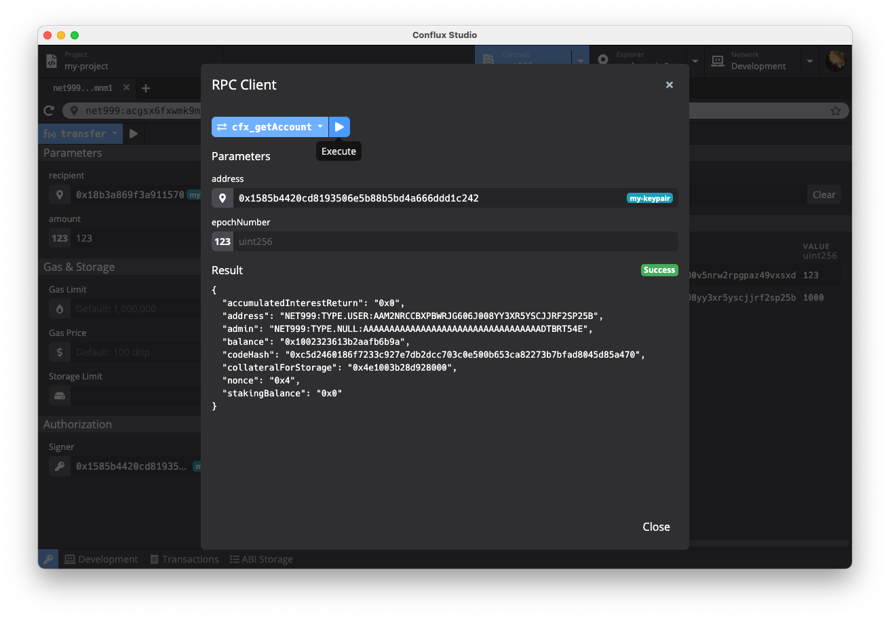

# Conflux Studio

Conflux Studio is an integrated development environment (IDE), making developing [Conflux](https://confluxnetwork.org/) smart contracts faster and easier. 

English | [简体中文](https://github.com/ObsidianLabs/ConfluxStudio/blob/master/README-CN.md)

## Install

### Download

Download Conflux Studio install-package in [Github Release](https://github.com/ObsidianLabs/ConfluxStudio/releases) according to the computer system type (.dmg/.zip for macOS, .AppImage for Linux, .exe for Windows).

You can also download the latest the installation packages through the links ([Mac](https://download.obsidians.io/conflux/mac), [Windows](https://download.obsidians.io/conflux/win), [Linux](https://download.obsidians.io/conflux/linux)).

### Install

- **macOS**: Double click to open `ConfluxStudio-x.x.x.dmg` and drag `Conflux Studio` to the application folder.
  - For Apple silicon, use `ConfluxStudio-x.x.x-arm64.dmg`, for Intel core,  use `ConfluxStudio-x.x.x-x64.dmg`.
- **Linux**: Double-click to open `ConfluxStudio-x.x.x.AppImage`, select *Properties* => *Permissions* => *Execute*, and tick the *Allow executing file as progrom* option. Close the properties window and double-click to open the application (different Linux distributions may have different installation methods).
- **Windows**: Double click to run the `ConfluxStudio-x.x.x.exe`.

## Tutorial

Learn how to use Conflux Studio to completely develop a token DApp in the [Conflux DApp Tutorial](https://github.com/ObsidianLabs/conflux-dapp-tutorial/blob/master/README-EN.md).

## Features

### Preparation

When Conflux Studio is properly installed and started for the first time, users will see a welcome page, where the dependencies for Conflux are displayed, including Docker, Conflux Node and Conflux Truffle.

  

- [**Docker**](https://www.docker.com/) is used to to start the Conflux Node and compile projects in Conflux Studio. If Docker is not installed yet, users can click the *Install Docker* button to visit the official Docker website and download and install it.
- [**Conflux Node**](https://github.com/Conflux-Chain/conflux-rust) is the Conflux node image officially provided by Conflux. Conflux Studio uses the image to run the Conflux node and compile projects.
- [**Conflux Truffle**](https://github.com/Conflux-Chain/conflux-truffle) is a Conflux version of truffle used to create and compile projects.

When all the dependencies are properly installed and run, the gray *Skip* button will change into a green *Get Started* button. Click the button to enter the main interface of Conflux Studio.

### Create Keypairs

After entering the main interface, users need to create some keypairs by opening the keypair manager by clicking the key icon at the bottom left on any interface of Conflux Studio.

  

Users can create, import and manage keypairs in the keypair manager. When creating and editing a keypair, users can set an alias for the keypair to facilitate identification in later use. Besides storing and managing keypairs, the keypair manager will also provide a genesis address for the genesis block. When creating a new Conflux node instance, all addresses in the keypair manager will be regarded as genesis addresses, and each address will get a total of 10,000 initial CFX tokens.

**Before the following steps, users need to create some keypairs in the key manager as the genesis address for creating node instances.**

### Start the Node

Click the *Network* tab at the top to switch the main interface to the network manager. In the network manager, users can manage Conflux node versions and node instances, including downloading and deleting Conflux node versions, and creating, deleting and running node instances in line with different versions.

Click the *New Instance* button in the upper right corner of the main interface to open the pop-up window for creating a new instance. Fill in the instance name and select the appropriate Conflux version, and click the *Create* button to complete the creation of a node instance.

  

When a node instance is created, the instance list will show the newly created instance. Click the green *Start* button of the instance to start the Conflux node. After starting, users can check the node running log in the log viewer below.

  

### Block Explorer

After the node is started, click the *Explorer* tab at the top to switch the main interface to the block explorer. In the block explorer, users can query the information of a given address. This module is still under development, so users can only check the balance in the explorer currently.

Copy the address generated from the keypair manager, paste the address in the address bar and click Enter, then the balance of the address will be visible.

  

### Create Smart Contract Projects

Click the *Project* tab at the top to switch the main interface to the project manager. Click the *New* button in the upper right corner of the page to open the Create a New Project pop-up window, enter the project name and select an appropriate template. Currently Conflux Studio provides two templates:

- `coin`：the coin smart contract provided by the Conflux instance
- `[Truffle] metacoin`：a contract created using Conflux Truffle; the project cannot be deployed to the Conflux node at present

  

After the project is created, the main interface will switch to the project editor. The project editor consists of several commonly used development modules, including a file browser, code editor, toolbar, log viewer, etc.

### Compile Smart Contract Projects

Click the compile button (hammer-shaped) on the toolbar, Conflux Studio will compile the project, and you can view the compilation result through the log viewer below. After compilation, a json file will be generated in the `build` folder under the project directory.

  

### Deploy Smart Contract Project

Click the deploy button (boat-shaped) on the toolbar to open the *Deploy* modal. You can enter constructor parameters, signer, gas limit and gas price for the deployment.

  

Click the *Deploy* button, Conflux Studio will deploy the project, and the deployment result will be displayed in a pop-up window.

  

### Call the Contract

After successfully deploying the smart contract, click the blue *contract* button in the pop-up window, the main interface will switch to the contract explorer, and Conflux Studio will automatically open the smart contract just deployed.

The contract explorer interface includes two parts:

- On the left is the calling method of the contract. Click the blue button in the upper left of the left column, the drop-down box displays the methods defined by the current contract. Users can click the method name to select the calling method.
- On the right is the data reading of the contract. Click the blue button in the upper left of the right column,  the drop-down box shows the data table of the current contract. Users can click the table name to view the data in different tables.

Conflux Studio will automatically read the functions in the contract ABI and generate a parameter table for each function. Select the function to be called, enter the parameters, select the signer (the signer should be an existing address in the keypair manager; the read operation does not need to be selected), and click the run button to call the contract. The call result (success or failure) will be displayed in the result viewer below.

  

Next, create coins using the deployed contract. Select the *mint* method, enter the *receiver* address (which can be copied from the keypair manager) and an appropriate amount in the *Parameters* part, enter the genesis address in the *Authorization* part, and click the execution button above. After completing the transaction, users can see the result of successful execution in the *Result* viewer in the lower left column. Now we have created new coins.

In the *balance* table on the right, enter the *receiver* address just filled in in the Parameters Part, click the execution button, and users can see the total number of coins minted just now.

  

### Invoke smart contract

After the contract is deployed, click the contract address in the Transaction Details popup and user will be redirected to Contract Inspector. Users may also click _Contract_ tab to switch to Contract Inspector and type in the address to open a contract. Conflux Studio's contract inspector allows users to open and debug multiple contracts at the same time.

Contract Inspector is mainly divided into three parts:

- Write methods on the left: Invoke write methods in the contract by selecting from the violet drop-down list;
- Read data in the middle: Read data as predefined data types in the contract by selecting from the violet drop-down list;
- Query event logs on the right: Query event logs as defined in the contract by selecting from the violet drop-down list.

  

Conflux Studio automatically stores contract ABI after deployment and generates above lists of write methods, data retrieval, event query and their corresponding parameter forms. For more information on ABI, please refer to [ABI Storage](#abi-storage).

Now, let's open the `GLDToken` contract we deployed moments ago to demo how to access the contract with Contract Inspector.

First, select _transfer_ method from the drop-down list on the left column. _Transfer_ method moves a specified amount of tokens from one address to another. We need to populate the parameter form to complete the transaction:

- Select `keypair02` from the drop-down list as the recipient (manual key-in address is also accepted) and type in 100 for amount as we wish to transfer 100 token in this example;
- Leave all forms in the Gas section to Conflux Studio to estimate.
- Select `keypair01` from the drop-down list in the Signer column. This also designates `keypair01` as the sender in this transaction.

Then click _Execute_ (Play) button next to _transfer_ to push and execute the transaction. Moments later, Ethereum Network will prompt messages stating transaction status and fee information.

  

Let's proceed by verifying the outcome of last transaction. Select _balanceOf_ from the drop-down list of data types, then select `keypair02` from the drop-down list in the account column. And finally hit _Execute_ (Play) button to read the data. The result will be shown below, which in our example, is 100. This verifies that the above transfer transaction of 100 tokens to `keypair02` has been successfully carried out.

  

Finally, we pick _Transfer_ from the drop-down list of contract events and click _Get event logs_ (Play) button to query all transfer-related events. Results are shown below in the Event Logs section. Conflux Studio supports a customized range for events query, but can only return maximum 10,000 queries when connecting to local nodes or testnets, and by default the most recent 10,000 records. Therefore, users should keep the custom range within the aforementioned number. When connecting to Ethereum mainnet, the maximum number of event log queries goes down to 1,000.

  

#### ABI Storage

When working with Code Inspector, Conflux Studio relies on contract ABI to generate lists of methods, data types and event types. ABI Storage at the bottom is the place where these ABIs are stored. Upon successful deployment of contract, Conflux Studio automatically stores contract ABI(s). Users may view the raw ABI data by moving the cursor onto the ABI record and click _Edit_ (pencil) icon, or click _Delete_ button to remove the ABI record.

  

In case when users need to access other contracts (an online contract, for example), he/she needs to add the contract ABI to ABI Storage. Click _New_ button in the ABI Storage popup to start the process. For users' convenience, Conflux Studio also reads ABI from all compiled contracts in the current project. Click _Select from the current project_ and select to import ABI from the drop-down list.

  

#### Transaction History

Conflux Studio records every transaction pushed to the network. To view recent transactions, click _Transactions_ tab to pull up the list of transactions. Users may single click on a transaction to pull up Transaction Details popup and review information such as Basics, Parameters, Tx and Receipt.

  

### Network Button

There is a network icon on the bottom bar, which shows the network status. The icon is dark when network disconnected and light when networ connected. Click the network button can toggle the connection status.

  

#### RPC Client

Conflux Studio also comes with an RPC client allowing users to interact with Ethereum nodes on the low level and examine the raw data. Click the network name tab at the bottom and select _RPC Client_ from the drop-down list to pull up RPC Client popup. RPC Clients supports all Ethereum RPC methods. Select from the drop-down list to start, and Conflux Studio will generate the corresponding parameter form automatically. Fill out necessary parameters and hit _Execute_ button to call the method and view the response in the Result section.

  

